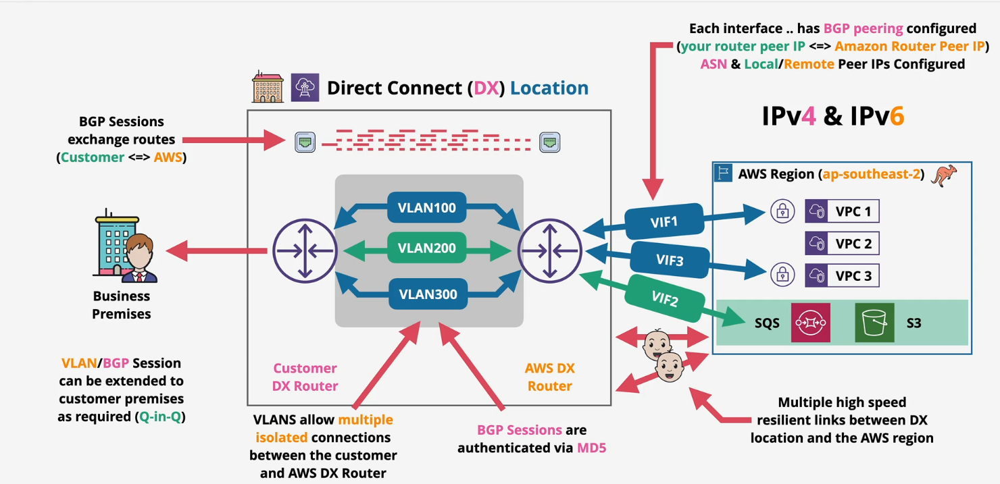
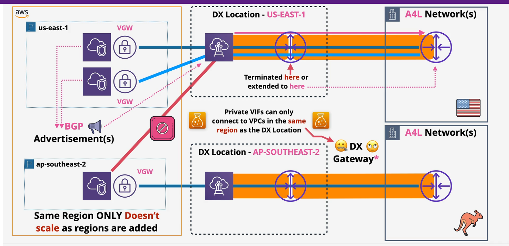
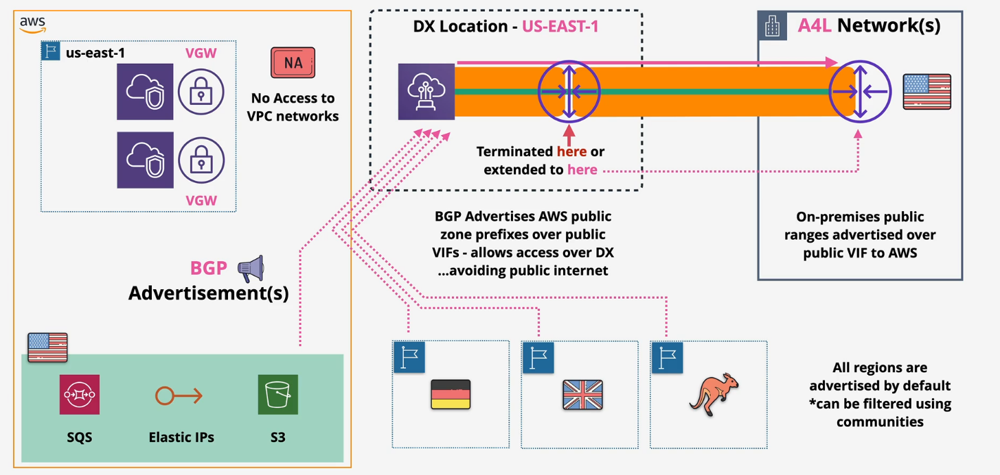
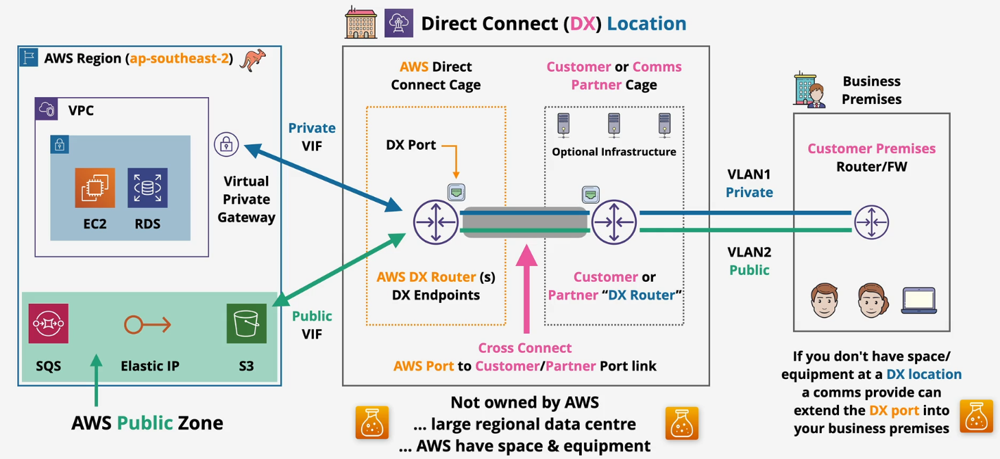
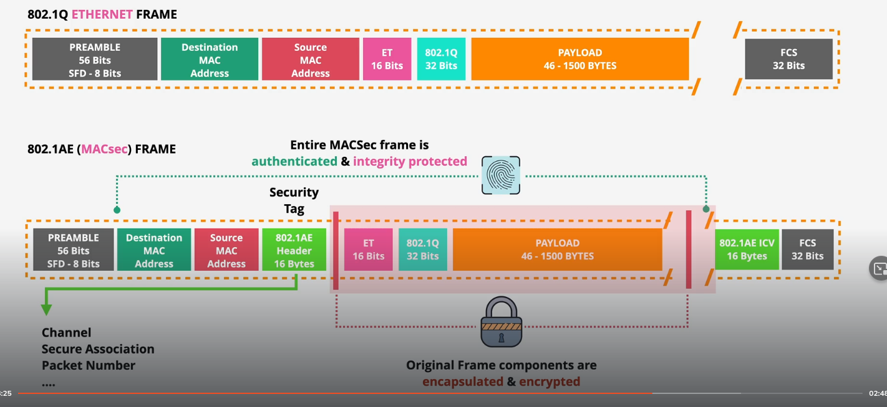
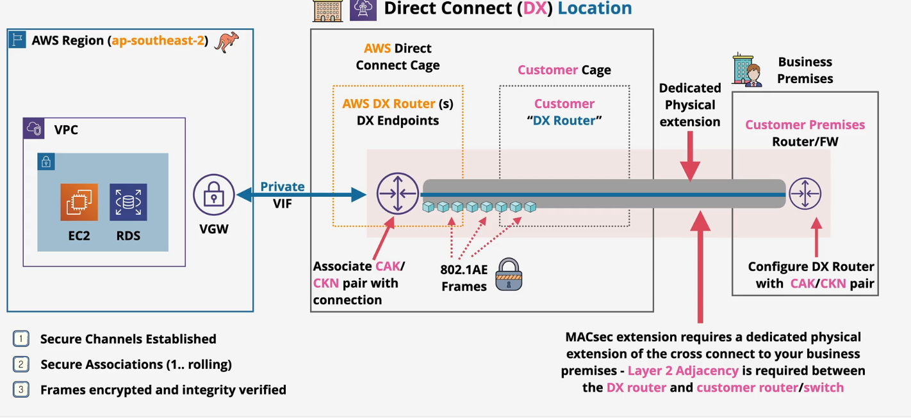

# VPC Hybrid Networking (Physical) - Deep Dive 

O direct connect é uma conexação estritamente física entre o data center on-premisses, a zona do DX (DX Location) e uma região da AWS. Na DX Location a AWS disponibiliza uma porta física para a conexão se Estabelecida.

- On-Premisses > DX Location > AWS Region

AWS leva um tempo para disponibilizar a porta na DX Location, pois é uma instalação física. A DX LOcation não é propriedada da AWS, muitas vezes é um provedor de datacenter, por exemplo Tivit, Equinix.

Uma vez que a infra estrutura esteja habilitada no provedor de serviços (Equinix e Tivit por exemplo). Uma cross connection é feita entre a porta do DX e o router do provedor e o seu roteador no Onpremisses.

Vael lembrar que o DX é conectado a uma AWS region e para estabelecer comunicação com os serviços da AWS, é preciso estabelecer interfaces virtuais sob a conexação física do DX.

## VIFs
As VIFs vascimanete são o mecanismo que permitem estabelecer comunicação de layer 03 sobre a layer 02.

A grosso modo uma VIF é uma sessão BGP.

Existem alguns tipos de VIFs (Virtual Interfaces):

 - Public VIF's: Estabelecem comunicação com  os serviços públicos da AWS (sqs, s3, servi catalog e etc)
 - Private VIF's: Estabelecem comunicação com os serviços privados da AWS (ec2, vpc, rds e etc).
 - Transit VIF's: Estabelecem comunicação com Transit Gateways.

Um detalhe importante é que na arquitetura física do DX, não existem cripotgrafia na leyer física da conexão cross ou até mesmo nas VIFs.

- Conexões Privadas: Para realizar a conexão com algum serviço privado basicamente é necessário estabalecer uma sessão BGP (Private VIF), conectada a uma VPC através de um Virtaul Private Gateway  (VGW) da mesma região da conexão do DX.

A VIF é um serviço regional, essa limitação pode ser contornada por um Direct COnnect Gateway.

- Conexões Públicas: Ao contrário das VIFs privadas as VIF's Públicas não necessitam de um VGW, pois a via BGP Advertisment todos os blocos de Ips públicos da AWS são declarados para a VIF.

 ## Arquitetura do DX:

## Bidirectional Forwarding Detection 
É uma feature que possibilita contruir uma maior redundancia entre VIFs.

Como cada VIF é uma sessão BGP, por padrão o BGP envia Keep ALives a cada 90 segundos para saber se a sessão continua ativa ou não, porém noventa segundos pode ser extremamente perigoso para aplicações críticas, então  BFD ajuda a idenficar uma queda de VIF em até 900ms, pois o BFD envia 3 keep alives com intervalo de 300 ms. Ou seja se a VIF estiver down, ela será identificada em até 900 ms.
## Velocidades de conexão

As portas na DX Location suportam  1 Gbps, 10 Gbps e 100 Gbps.

## Custos

A porta disponibilizada pela AWS (DX Location port) é cobrada por hora disponível e tráfego OUtbound (Data transfer)

## Direct Connect MAC Sec

Feature de Segurança habilitada no DX que pemrite a confidencialidade, nas transmissão de data frames na layer 2 da camada OSI.

Como por padrão o serviço de DX não possuí cripotgrafia na conexão cross dos datacenters, toda comunicação ocorre em texto puro na transmissão dos dados. Para solucionar este ponto seria possível estabelecer uma conexão de VPN IPsec em cima da conexão cross do DX, poreḿ isto seria custoso. O MAC Sec pode ajudar neste ponto uma vez que é possível habilitar esta feature ao criar canis de comunicações segurps entre os roteadores e conexoes cross envolvidas. A partir daí uma assinatura é exigida e adicionada nos frames da Layer 02. Onde apenas os equipamentos assinados e envolvidos na conexeão poderão realizar a decriptografia do payload do dataframe.

## Direct Connect Gateway

## Letter of Authorization CUstomer Facility Access (LOA-CFA)

Dcoumento que autoriza a terceiros realizar a conexão do DX.